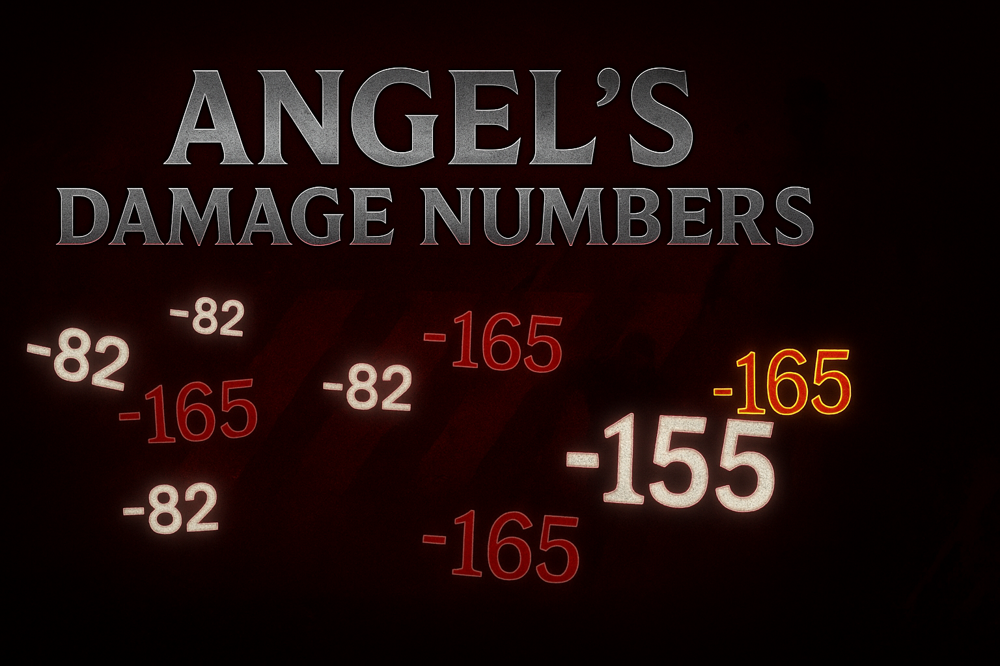
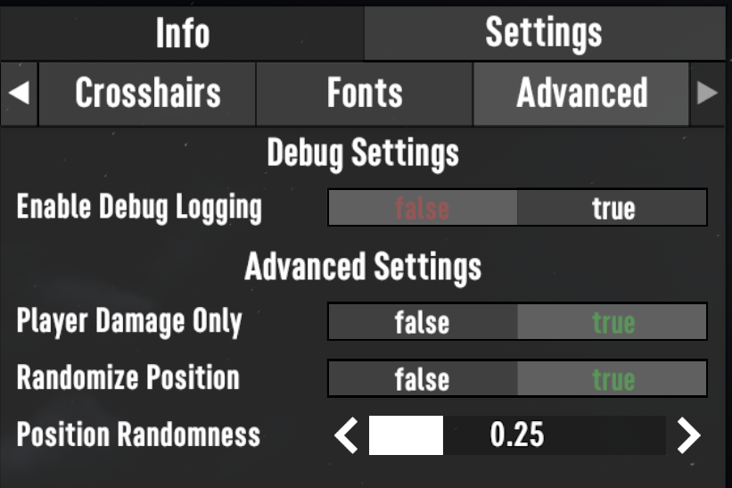
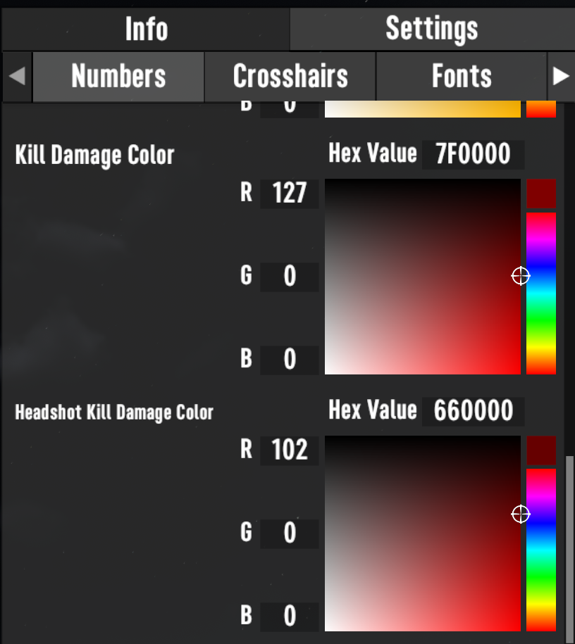
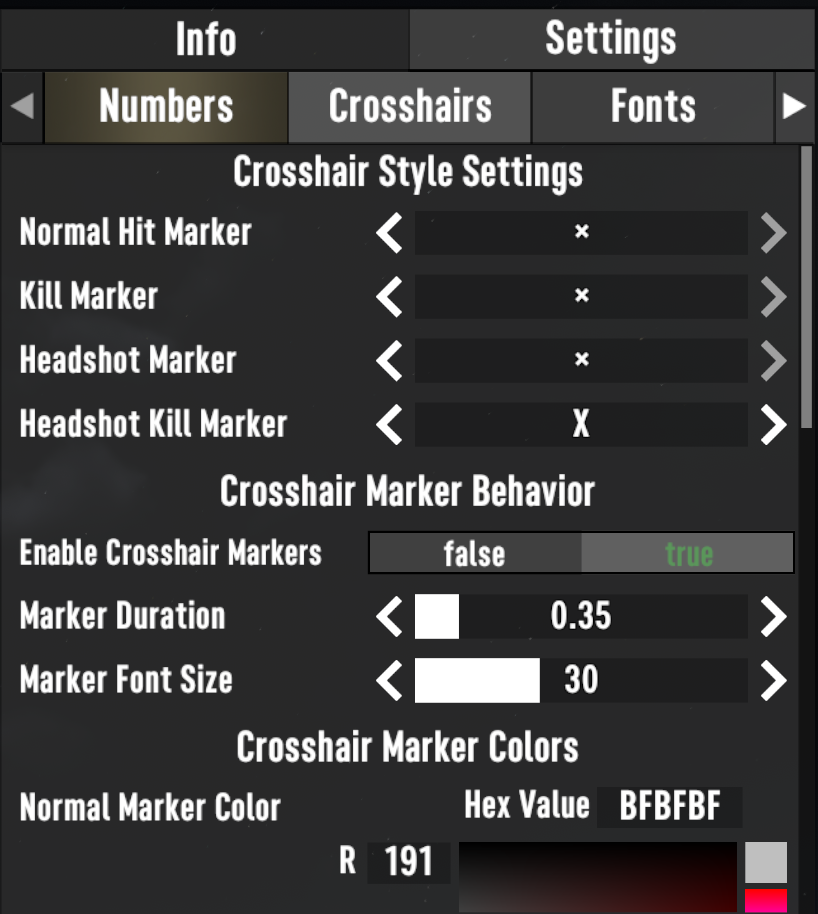
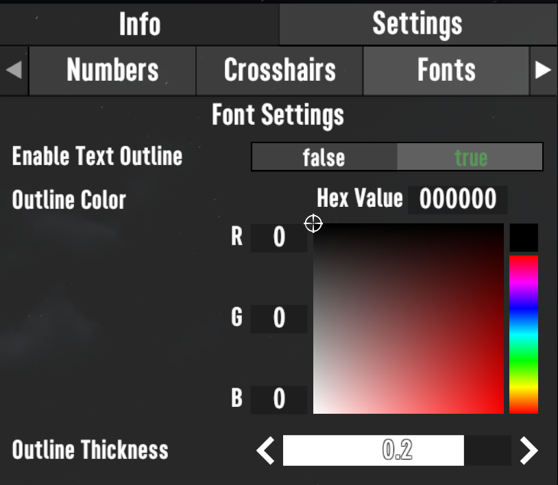

# Angel's Damage Numbers v3.0

<p align="center">
  
</p>

A floating damage numbers mod for **7 Days to Die** that provides instant visual feedback during combat.
Built with defensive coding principles to ensure reliability, stability, and performance without complicating your setup.

---

## Quick Links
- [Download on Nexus](https://www.nexusmods.com/7daystodie/mods/8478)
- [Optional Gears Mod (for in-game UI)](https://www.nexusmods.com/7daystodie/mods/4017)
- [License](#license)
- [Changelog](#changelog)

---

## Features

- **Floating Damage Numbers** — Customizable colors for normal hits, headshots, kills, and headshot kills
- **Crosshair Hit Markers** — Screen-center indicators that flash on successful hits
- **TextMeshPro Rendering** — High-quality fonts with outline support for better visibility
- **Dual Configuration** — Traditional XML files plus optional in-game UI (via Gears mod)
- **Performance Optimized** — Smart culling, cooldowns, and efficient memory usage
- **No Corpse Spam** — Numbers only appear on living targets and actual player damage
- **Memory Safe** — Proper cleanup prevents long-term degradation

---

## Philosophy: Modding as Enrichment

This mod is designed around the idea that **modding should enrich gameplay, not complicate it**:

- Works instantly with sensible defaults
- Gracefully degrades when dependencies are missing — no crashes
- No prerequisites required
- Enhances feedback without changing gameplay balance

The goal is **immediate enrichment with zero friction**.

---

## Technical Philosophy

- **Defensive by Design** — Extensive error handling and fallback mechanisms
- **Dependency Isolation** — Gears integration is optional and fully separated
- **Fail-Safe Defaults** — Every setting has a working baseline
- **Progressive Enhancement** — XML configs stand alone; Gears UI adds convenience

---

## Installation

1. [Download the mod](https://www.nexusmods.com/7daystodie/mods/8478)
2. Extract to the `Mods/` folder
3. Disable **EAC** (required for all DLL mods)
4. Launch the game — the mod works immediately
5. *(Optional)* Install [Gears](https://www.nexusmods.com/7daystodie/mods/4017) for in-game configuration

---

## Configuration

### Automatic (Default)
- Sensible defaults are applied automatically.
- No user input required for basic functionality.

### In-Game UI (Optional, requires Gears)

#### Advanced Settings


Toggle debug logging, restrict numbers to player-only damage, or randomize position for more dynamic effects.

---

#### Color Pickers


Full RGB + hex color control for every damage type: normal, headshot, kill, and headshot kill.

---

#### Crosshair Settings


Customize hit markers at the center of your crosshair. Adjust duration, size, and styles for each hit type.

---

#### Outline Settings


Enable outlines around damage numbers for maximum visibility, with adjustable thickness and color control.

With Gears installed, configure the mod via **Options > Mods > Angel's Damage Numbers**.
Settings include color pickers, sliders, and toggles. Changes apply instantly without restart.

---

### XML File (Traditional)
Advanced users can edit:
```

Mods/Angel\_DamageNumbers/AngelDamageNumbersConfig.xml

```

---

## Architecture Highlights

- **Shim Pattern** — Gears integration is optional and isolated
- **Automatic Fallbacks** — Font loading, config, and camera detection all degrade gracefully
- **Error Boundaries** — Failures in one area won’t crash the mod
- **Clean Lifecycle** — Proper initialization and cleanup ensures stability

---

## License
MIT License

---

## Contributing
1. Fork the repository
2. Create a feature branch
3. Follow defensive coding principles
4. Submit a pull request

**Guideline:** Always prioritize stability and user experience. Defaults must be safe, errors must degrade gracefully.

---

## Changelog

### v3.0.0
- Added optional Gears integration with in-game configuration UI
- Implemented TextMeshPro rendering with outline support
- Fixed memory leaks and improved long-term performance
- Suppressed damage numbers for corpses/dead entities
- Added automatic XML migration from older versions
- Enhanced error handling and graceful fallbacks
- Improved default settings
- Refactored architecture for maintainability
```
